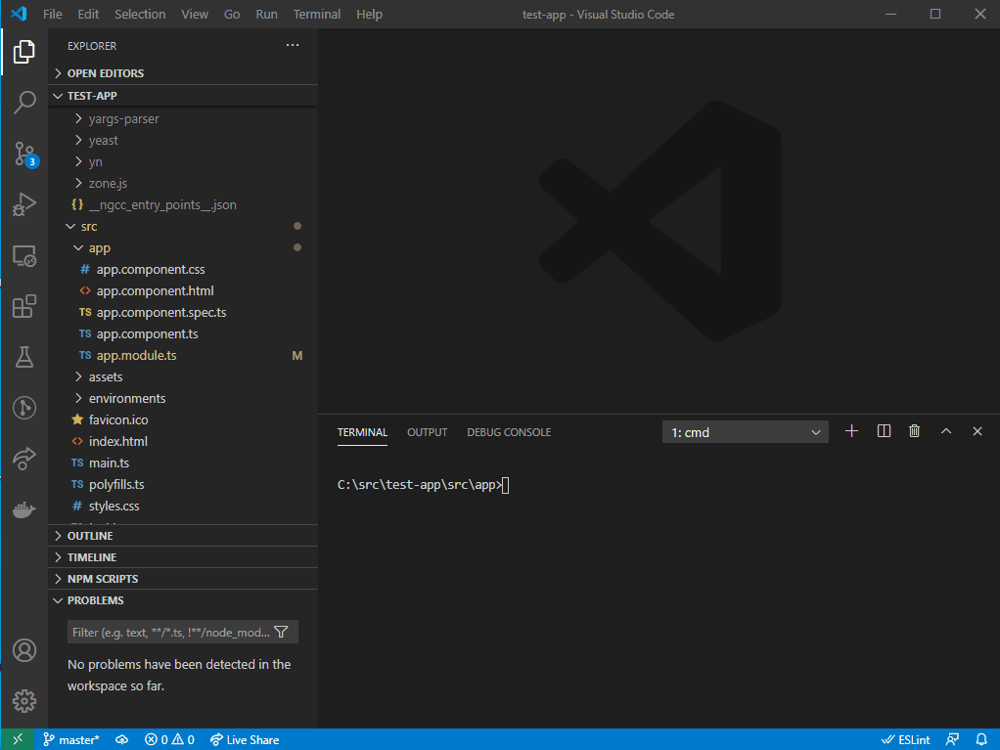

# Angular Testing Library Schematic

## The problem

Using `ng g c my-component` gives you a sparkly new spec file to write your test in. But what if you are using the awesome angular-testing-library?

## This solution

This package gives you a schematic that you can use to overwrite the default spec file with a _super_-sparkly angular-testing-library version!



## Installation

Because the package name matters, npm install with an alias - I recommend `tls`:

`npm i --save-dev tls@npm:@iangrainger/angular-testing-library-schematic`

## Use

Run `ng g c my-component` as you normally would, then `ng g tls:tls my-component` to overwrite the spec with an angular-testing-library specific one.

## Known issues

This library doesn't have all the smarts of the normal component generator, so it won't (for example) work correctly if you run if from the project route (the file should be created in `src/app`, then!). It also can't deal with the component generator's 'flat' option etc.

### Testing

To test locally, install `@angular-devkit/schematics-cli` globally and use the `schematics` command line tool. That tool acts the same as the `generate` command of the Angular CLI, but also has a debug mode.

Check the documentation with

```bash
schematics --help
```

### Unit Testing

`npm run test` will run the unit tests, using Jasmine as a runner and test framework.

### Publishing

To publish, simply do:

```bash
npm run build
npm publish
```

That's it!
